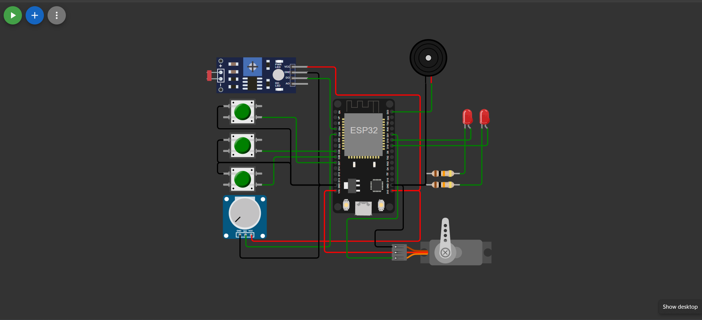
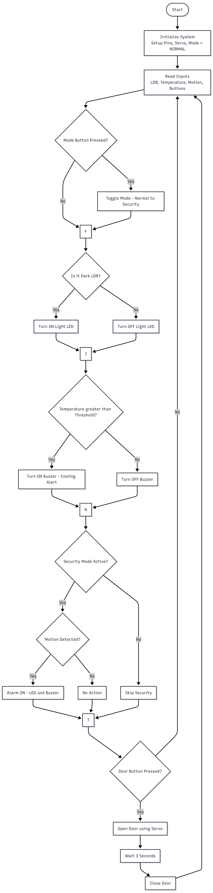
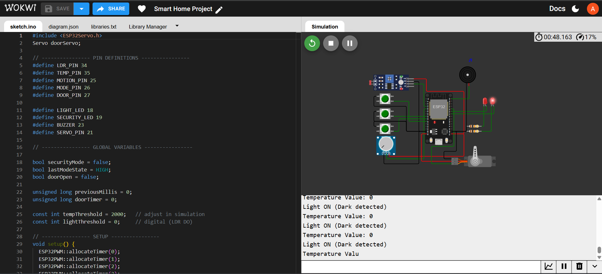
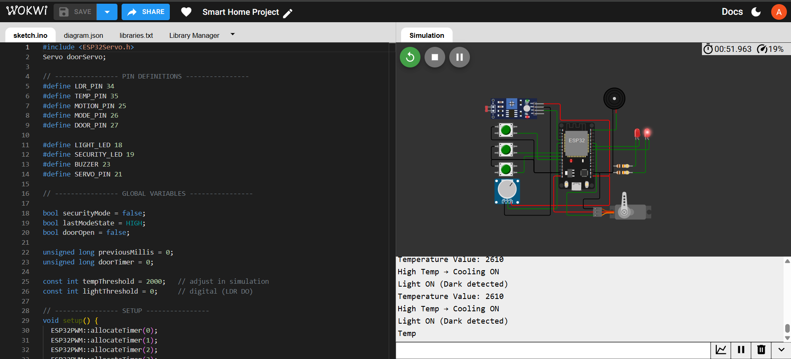
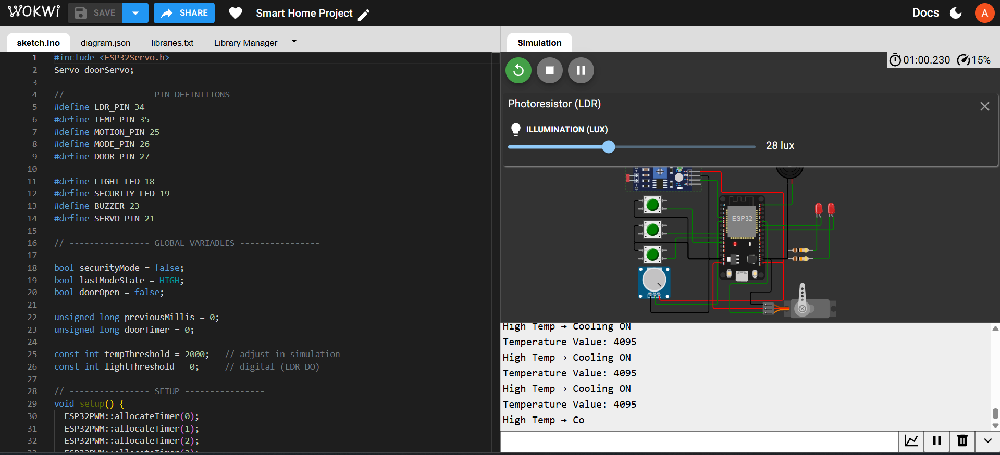
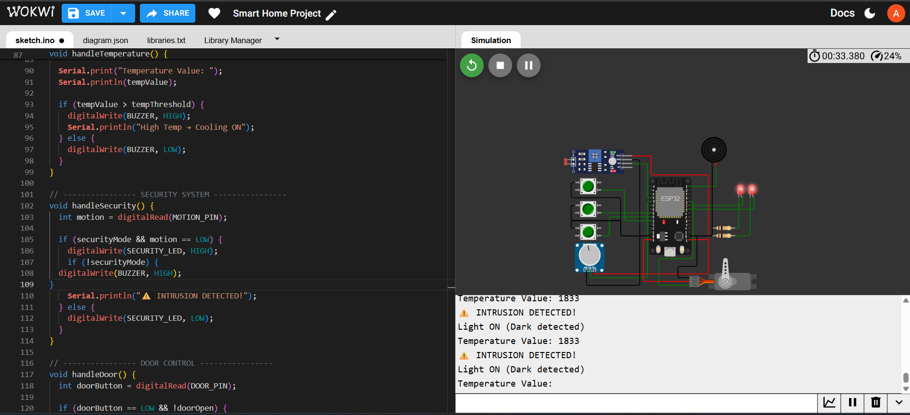

# Smart Home Automation and Security System (ESP32)

## 📌 Overview
This project demonstrates a Smart Home Automation and Security System implemented using ESP32 simulation on Wokwi. The system integrates multiple sensors and actuators to automate lighting, monitor temperature, detect intrusion, and control door access.

It follows an event-driven embedded system approach where inputs are continuously monitored and actions are executed in real time.

---

## ⚙️ Features
- 💡 Automatic lighting using LDR (Light Dependent Resistor)
- 🌡️ Temperature monitoring with threshold-based alert system
- 🚨 Security system with motion detection and alarm activation
- 🔄 Mode switching (Normal Mode ↔ Security Mode)
- 🚪 Automatic door control using servo motor with timed closing

---

## 🛠️ Technologies Used
- ESP32 Microcontroller
- Arduino Programming (C++)
- Wokwi Simulator
- Embedded System Design

---

## 📂 Project Structure
├── SmartHome_Automation.ino.txt → Source Code
├── SmartHome_Report.docx → Project Report
├── Flowchart.png → System Flowchart
├── Circuit_Diagram.png → Circuit Design
├── Output_SS1.png → Output Screenshot 1
├── output_SS2.png → Output Screenshot 2
├── output_SS3.png → Output Screenshot 3
├── output_SS4.png → Output Screenshot 4

---

## 🚀 Working Principle
The system continuously reads sensor inputs and processes them using ESP32:

- LDR controls lighting automatically
- Temperature sensor triggers buzzer alert when threshold is exceeded
- Motion detection activates security alarm in Security Mode
- Door opens using servo motor on button press and closes automatically after 3 seconds

---

## 📸 Output Screenshots

### 🔹 Circuit Diagram

### 🔹 Flowchart

### 🔹 Simulation Outputs

---

## 📌 Note
ESP32 has been used for simulation due to tool constraints, while the design remains compatible with ESP8266 as specified in the project requirements.

---

## 🔗 Simulation Link
(Add your Wokwi project link here)

---

## 👩‍💻 Author
**Amulya S Gupta**

---
